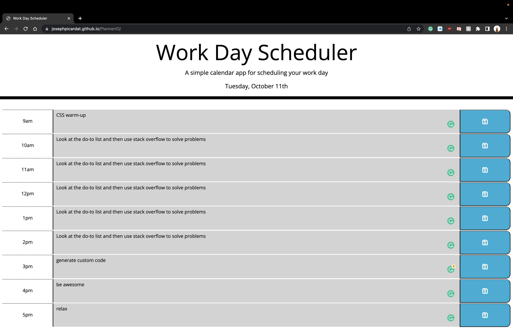

# Work PlannerIO

  ## Description

  What was my motivation?
  - To create a website that has a live planner and can be updated day to day.

  Why did I build this project?
  - I built this project in order to save data using local storage and use third party API's

  What problem does it solve?
  - It solves the problem of not being able to save data when refreshing the page

  What did I learn?
  - I learned how to incorporate local storage and third party API's
  

  ## Table of Contents

  - [Installation](#installation)
  - [Usage](#usage)
  - [Contributing](#contributing)
  - [Tests](#tests)
  - [Questions](#questions)
  - [License](#license)

  ## Installation

  In order to use this project, open the link down below in usage! Or if you want to download it, clone the repositroy to your desired location on your computer.

  ## Usage

  link: https://josephpicardat.github.io/PlannerIO/

  

  ## Contributing

  Only myself and I

  ## Tests

  No tests required for this project!

  ## Questions

  Github Profile: josephpicardat

  If you need to reach me, you can with through my email: josephpicardat1@gmail.com

  ## License

  
  (https://opensource.org/licenses/MIT)

  Copyright 2022 Joseph Picardat

  Permission is hereby granted, free of charge, to any person obtaining a copy of this software and associated documentation files (the "Software"), to deal in the Software without restriction, including without limitation the rights to use, copy, modify, merge, publish, distribute, sublicense, and/or sell copies of the Software, and to permit persons to whom the Software is furnished to do so, subject to the following conditions:

    The above copyright notice and this permission notice shall be included in all copies or substantial portions of the Software.
    
    THE SOFTWARE IS PROVIDED "AS IS", WITHOUT WARRANTY OF ANY KIND, EXPRESS OR IMPLIED, INCLUDING BUT NOT LIMITED TO THE WARRANTIES OF MERCHANTABILITY, FITNESS FOR A PARTICULAR PURPOSE AND NONINFRINGEMENT. IN NO EVENT SHALL THE AUTHORS OR COPYRIGHT HOLDERS BE LIABLE FOR ANY CLAIM, DAMAGES OR OTHER LIABILITY, WHETHER IN AN ACTION OF CONTRACT, TORT OR OTHERWISE, ARISING FROM, OUT OF OR IN CONNECTION WITH THE SOFTWARE OR THE USE OR OTHER DEALINGS IN THE SOFTWARE.

